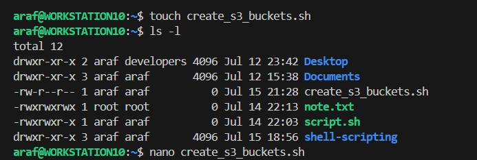
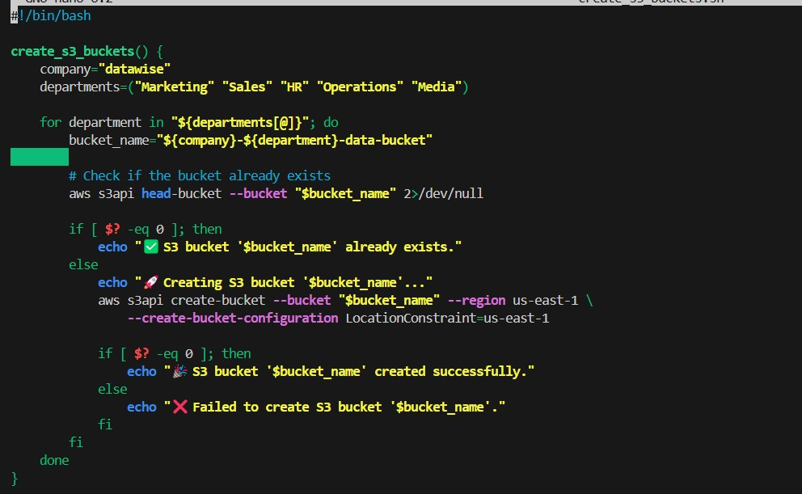
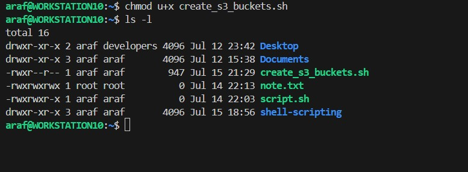

# error-handling-shell-scripting

creating s3 buckets for different departments using shell scripting

create a new file named create_s3_buckets.sh and write the following code:

```
# Function to create S3 buckets for different departments
#!/bin/bash

create_s3_buckets() {
    company="datawise"
    departments=("Marketing" "Sales" "HR" "Operations" "Media")

    for department in "${departments[@]}"; do
        bucket_name="${company}-${department}-data-bucket"
        
        # Check if the bucket already exists
        aws s3api head-bucket --bucket "$bucket_name" 2>/dev/null

        if [ $? -eq 0 ]; then
            echo "✅ S3 bucket '$bucket_name' already exists."
        else
            echo "🚀 Creating S3 bucket '$bucket_name'..."
            aws s3api create-bucket --bucket "$bucket_name" --region us-east-1 \
                --create-bucket-configuration LocationConstraint=us-east-1

            if [ $? -eq 0 ]; then
                echo "🎉 S3 bucket '$bucket_name' created successfully."
            else
                echo "❌ Failed to create S3 bucket '$bucket_name'."
            fi
        fi
    done
}

# Call the function
create_s3_buckets

```





make the file executable with `chmod +x create_s3_buckets.sh`


